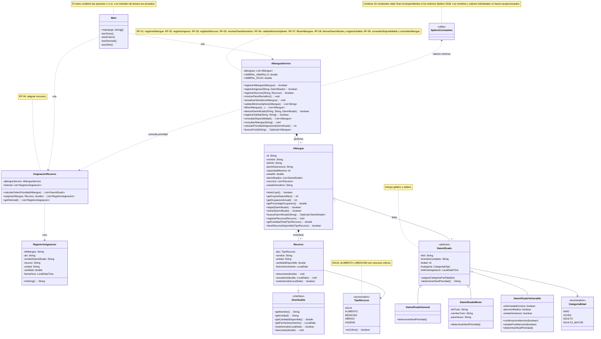

# Diagrama de clases UML

```mermaid
classDiagram
    direction TB

    class Main {
        +main(args: String[])
        -leerTexto()
        -leerEntero()
        -leerDecimal()
        -leerSiNo()
    }

    class SphereConstantes {
        <<utility>>
    }

    class AlbergueService {
        -albergues: List~Albergue~
        +UMBRAL_AMARILLO: double
        +UMBRAL_ROJO: double
        +registrarAlbergue(Albergue): boolean
        +registrarIngreso(String, Damnificado): boolean
        +registrarRecurso(String, Recurso): boolean
        +mostrarPanelSemaforo(): void
        +actualizarSemaforo(Albergue): void
        +validarMinimosSphere(Albergue): List~String~
        +filtrarAlbergues(...): List~Albergue~
        +derivarDamnificado(String, String, Damnificado): boolean
        +registrarSalida(String, String): boolean
        +consultarDisponibilidad(): List~Albergue~
        +consultarAlbergue(String): void
        +calcularPrioridadAsignacion(Damnificado): int
        +buscarPorId(String): Optional~Albergue~
    }

    class AsignacionRecurso {
        -albergueService: AlbergueService
        -historial: List~RegistroAsignacion~
        +calcularOrdenPrioridad(Albergue): List~Damnificado~
        +asignar(Albergue, Recurso, double): List~RegistroAsignacion~
        +getHistorial(): List~RegistroAsignacion~
    }

    class RegistroAsignacion {
        -idAlbergue: String
        -dni: String
        -nombreDamnificado: String
        -recurso: String
        -unidad: String
        -cantidad: double
        -fechaHora: LocalDateTime
        +toString(): String
    }

    class Albergue {
        -id: String
        -nombre: String
        -distrito: String
        -tipoInfrastructura: String
        -capacidadMaxima: int
        -areaM2: double
        -damnificados: List~Damnificado~
        -recursos: List~Recurso~
        -estadoSemaforo: String
        +tieneCupo(): boolean
        +getCuposDisponibles(): int
        +getOcupacionActual(): int
        +getPorcentajeOcupacion(): double
        +alojar(Damnificado): boolean
        +retirar(Damnificado): boolean
        +buscarDamnificado(String): Optional~Damnificado~
        +registrarRecurso(Recurso): void
        +getCantidadTotal(TipoRecurso): double
        +tieneRecursoDisponible(TipoRecurso): boolean
    }

    class Recurso {
        -tipo: TipoRecurso
        -nombre: String
        -unidad: String
        -cantidadDisponible: double
        -fechaVencimiento: LocalDate
        +descontar(double): void
        +actualizar(double, LocalDate): void
        +estaVencido(LocalDate): boolean
    }

    class Distribuible {
        <<interface>>
        +getNombre(): String
        +getUnidad(): String
        +getCantidadDisponible(): double
        +getFechaVencimiento(): LocalDate
        +estaVencido(LocalDate): boolean
        +descontar(double): void
    }

    class TipoRecurso {
        <<enumeration>>
        AGUA
        ALIMENTO
        MEDICINA
        ABRIGO
        HIGIENE
        +esCritico(): boolean
    }

    class Damnificado {
        <<abstract>>
        #dni: String
        #nombreCompleto: String
        #edad: int
        #categoria: CategoriaEdad
        #ultimaAsignacion: LocalDateTime
        +asignarCategoriaPorEdad(int)
        +determinarNivelPrioridad(): String
    }

    class CategoriaEdad {
        <<enumeration>>
        NINO
        JOVEN
        ADULTO
        ADULTO_MAYOR
    }

    class DamnificadoGeneral {
        +determinarNivelPrioridad()
    }

    class DamnificadoMener {
        -dniTutor: String
        -nombreTutor: String
        -parentesco: String
        +determinarNivelPrioridad()
    }

    class DamnificadoVulnerable {
        -enfermedadCronica: boolean
        -atencionMedica: boolean
        -estadoGestacion: boolean
        +confirmacionAtencion(boolean)
        +estadoPostAtencion(boolean)
        +determinarNivelPrioridad()
    }

    %% Relaciones originales

    Main ..> AsignacionRecurso : usa
    Main ..> AlbergueService : usa

    SphereConstantes <.. AlbergueService : valores minimos

    AlbergueService "1" *-- "0..*" Albergue : gestiona
    AlbergueService ..> AsignacionRecurso : consulta prioridad

    AsignacionRecurso ..> RegistroAsignacion : crea

    Albergue "1" *-- "0..*" Recurso : inventario
    Albergue "1" o-- "0..*" Damnificado : aloja

    Recurso ..|> Distribuible
    Recurso --> TipoRecurso

    Damnificado <|-- DamnificadoGeneral
    Damnificado <|-- DamnificadoMener
    Damnificado <|-- DamnificadoVulnerable

    Damnificado --> CategoriaEdad

    %% Informacion complementaria del modelo

    note for Main "El menu contiene las opciones 1 a 11. Los metodos de lectura son privados."

    note for SphereConstantes "Contiene 19 constantes static final correspondientes a los minimos Sphere 2018. Los nombres y valores individuales no fueron proporcionados."

    note for TipoRecurso "AGUA, ALIMENTO y MEDICINA son recursos criticos."

    note for Damnificado "Incluye getters y setters."

    note for AlbergueService "RF-01: registrarAlbergue. RF-02: registrarIngreso. RF-03: registrarRecurso. RF-05: mostrarPanelSemaforo. RF-06: validarMinimosSphere. RF-07: filtrarAlbergues. RF-08: derivarDamnificado y registrarSalida. RF-09: consultarDisponibilidad y consultarAlbergue."

    note for AsignacionRecurso "RF-04: asignar recursos."
```
