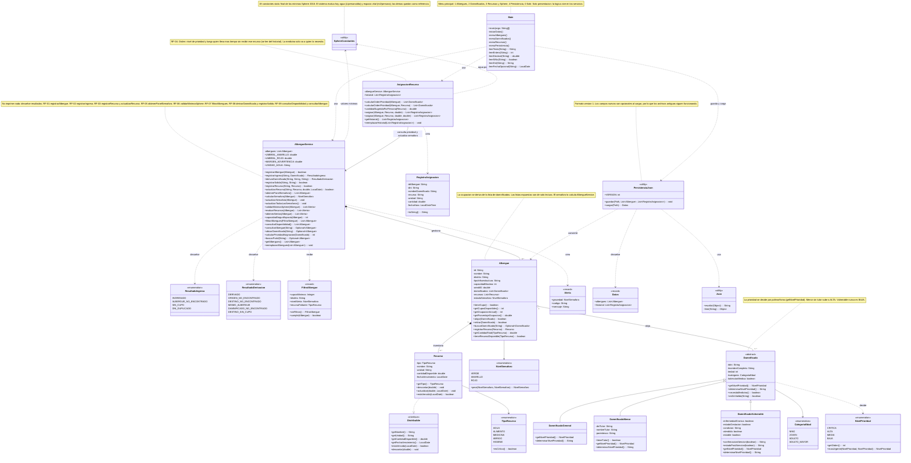

# Diagrama de clases UML

```mermaid
classDiagram
    direction TB

    class Main {
        +main(args: String[])
        -iniciarDatos()
        -menuAlbergues()
        -menuDamnificados()
        -menuRecursos()
        -menuPersistencia()
        -leerTexto(String): String
        -leerEntero(String): int
        -leerDecimal(String): double
        -leerSiNo(String): boolean
        -leerDni(String): String
        -leerFechaOpcional(String): LocalDate
    }

    class SphereConstantes {
        <<utility>>
    }

    class AlbergueService {
        -albergues: List~Albergue~
        +UMBRAL_AMARILLO: double
        +UMBRAL_ROJO: double
        +MARGEN_ADVERTENCIA: double
        +UNIDAD_AGUA: String
        +registrarAlbergue(Albergue): boolean
        +registrarIngreso(String, Damnificado): ResultadoIngreso
        +derivarDamnificado(String, String, String): ResultadoDerivacion
        +registrarSalida(String, String): boolean
        +registrarRecurso(String, Recurso): boolean
        +actualizarRecurso(String, Recurso, double, LocalDate): boolean
        +obtenerPanelSemaforo(): List~Albergue~
        +calcularSemaforo(Albergue): NivelSemaforo
        +actualizarSemaforo(Albergue): void
        +actualizarTodosLosSemaforos(): void
        +validarMinimosSphere(Albergue): List~Alerta~
        +evaluarRecursos(Albergue): List~Alerta~
        +obtenerAlertas(Albergue): List~Alerta~
        +capacidadSegunEspacio(Albergue): int
        +filtrarAlbergues(FiltroAlbergue): List~Albergue~
        +consultarDisponibilidad(): List~Albergue~
        +consultarAlbergue(String): Optional~Albergue~
        +ubicarDamnificado(String): Optional~Albergue~
        +calcularPrioridadAsignacion(Damnificado): int
        +buscarPorId(String): Optional~Albergue~
        +getAlbergues(): List~Albergue~
        +reemplazarAlbergues(List~Albergue~): void
    }

    class ResultadoIngreso {
        <<enumeration>>
        INGRESADO
        ALBERGUE_NO_ENCONTRADO
        SIN_CUPO
        DNI_DUPLICADO
    }

    class ResultadoDerivacion {
        <<enumeration>>
        DERIVADO
        ORIGEN_NO_ENCONTRADO
        DESTINO_NO_ENCONTRADO
        MISMO_ALBERGUE
        DAMNIFICADO_NO_ENCONTRADO
        DESTINO_SIN_CUPO
    }

    class FiltroAlbergue {
        <<record>>
        +cuposMinimos: Integer
        +distrito: String
        +nivelAlerta: NivelSemaforo
        +recursoFaltante: TipoRecurso
        +sinFiltros(): FiltroAlbergue
        +cumple(Albergue): boolean
    }

    class AsignacionRecurso {
        -albergueService: AlbergueService
        -historial: List~RegistroAsignacion~
        +calcularOrdenPrioridad(Albergue): List~Damnificado~
        +calcularOrdenPrioridad(Albergue, Recurso): List~Damnificado~
        +cantidadSugeridaPorPersona(Recurso): double
        +asignar(Albergue, Recurso, double): List~RegistroAsignacion~
        +asignar(Albergue, Recurso, double, double): List~RegistroAsignacion~
        +getHistorial(): List~RegistroAsignacion~
        +reemplazarHistorial(List~RegistroAsignacion~): void
    }

    class RegistroAsignacion {
        -idAlbergue: String
        -dni: String
        -nombreDamnificado: String
        -recurso: String
        -unidad: String
        -cantidad: double
        -fechaHora: LocalDateTime
        +toString(): String
    }

    class Albergue {
        -id: String
        -nombre: String
        -distrito: String
        -tipoInfraestructura: String
        -capacidadMaxima: int
        -areaM2: double
        -damnificados: List~Damnificado~
        -recursos: List~Recurso~
        -estadoSemaforo: NivelSemaforo
        +tieneCupo(): boolean
        +getCuposDisponibles(): int
        +getOcupacionActual(): int
        +getPorcentajeOcupacion(): double
        +alojar(Damnificado): boolean
        +retirar(Damnificado): boolean
        +buscarDamnificado(String): Optional~Damnificado~
        +registrarRecurso(Recurso): Recurso
        +getCantidadTotal(TipoRecurso): double
        +tieneRecursoDisponible(TipoRecurso): boolean
    }

    class Recurso {
        -tipo: TipoRecurso
        -nombre: String
        -unidad: String
        -cantidadDisponible: double
        -fechaVencimiento: LocalDate
        +getTipo(): TipoRecurso
        +descontar(double): void
        +actualizar(double, LocalDate): void
        +estaVencido(LocalDate): boolean
    }

    class Distribuible {
        <<interface>>
        +getNombre(): String
        +getUnidad(): String
        +getCantidadDisponible(): double
        +getFechaVencimiento(): LocalDate
        +estaVencido(LocalDate): boolean
        +descontar(double): void
    }

    class TipoRecurso {
        <<enumeration>>
        AGUA
        ALIMENTO
        MEDICINA
        ABRIGO
        HIGIENE
        +esCritico(): boolean
    }

    class NivelPrioridad {
        <<enumeration>>
        CRITICA
        ALTA
        MEDIA
        BAJA
        +getOrden(): int
        +masUrgente(NivelPrioridad, NivelPrioridad): NivelPrioridad
    }

    class NivelSemaforo {
        <<enumeration>>
        VERDE
        AMARILLO
        ROJO
        +peor(NivelSemaforo, NivelSemaforo): NivelSemaforo
    }

    class Alerta {
        <<record>>
        +gravedad: NivelSemaforo
        +codigo: String
        +mensaje: String
    }

    class Damnificado {
        <<abstract>>
        #dni: String
        #nombreCompleto: String
        #edad: int
        #categoria: CategoriaEdad
        #atencionMedica: boolean
        +getNivelPrioridad(): NivelPrioridad
        +determinarNivelPrioridad(): String
        +necesitaMedicina(): boolean
        +esDniValido(String): boolean
    }

    class CategoriaEdad {
        <<enumeration>>
        NINO
        JOVEN
        ADULTO
        ADULTO_MAYOR
    }

    class DamnificadoGeneral {
        +getNivelPrioridad(): NivelPrioridad
        +determinarNivelPrioridad(): String
    }

    class DamnificadoMenor {
        -dniTutor: String
        -nombreTutor: String
        -parentesco: String
        +tieneTutor(): boolean
        +getNivelPrioridad(): NivelPrioridad
        +determinarNivelPrioridad(): String
    }

    class DamnificadoVulnerable {
        -enfermedadCronica: boolean
        -estadoGestacion: boolean
        -condicion: String
        -atendido: boolean
        -estable: boolean
        +confirmacionAtencion(boolean): String
        +estadoPostAtencion(boolean): String
        +getNivelPrioridad(): NivelPrioridad
        +determinarNivelPrioridad(): String
    }

    class PersistenciaJson {
        <<utility>>
        +VERSION: int
        +guardar(Path, List~Albergue~, List~RegistroAsignacion~): void
        +cargar(Path): Datos
    }

    class Datos {
        <<record>>
        +albergues: List~Albergue~
        +historial: List~RegistroAsignacion~
    }

    class Json {
        <<utility>>
        +escribir(Object): String
        +leer(String): Object
    }

    %% Relaciones

    Main ..> AsignacionRecurso : usa
    Main ..> AlbergueService : usa
    Main ..> PersistenciaJson : guarda y carga

    SphereConstantes <.. AlbergueService : valores minimos
    SphereConstantes <.. AsignacionRecurso : agua por persona

    AlbergueService "1" *-- "0..*" Albergue : gestiona
    AlbergueService ..> ResultadoIngreso : devuelve
    AlbergueService ..> ResultadoDerivacion : devuelve
    AlbergueService ..> FiltroAlbergue : recibe
    AlbergueService ..> Alerta : crea

    AsignacionRecurso --> AlbergueService : consulta prioridad y actualiza semaforo
    AsignacionRecurso ..> RegistroAsignacion : crea

    Albergue "1" *-- "0..*" Recurso : inventario
    Albergue "1" o-- "0..*" Damnificado : aloja
    Albergue --> NivelSemaforo

    Recurso ..|> Distribuible
    Recurso --> TipoRecurso

    Damnificado <|-- DamnificadoGeneral
    Damnificado <|-- DamnificadoMenor
    Damnificado <|-- DamnificadoVulnerable

    Damnificado --> CategoriaEdad
    Damnificado ..> NivelPrioridad : decide

    PersistenciaJson ..> Json : usa
    PersistenciaJson ..> Datos : devuelve
    PersistenciaJson ..> Albergue : convierte

    %% Informacion complementaria del modelo

    note for Main "Menu principal: 1 Albergues, 2 Damnificados, 3 Recursos y Sphere, 4 Persistencia, 0 Salir. Solo presentacion: la logica vive en los servicios."

    note for SphereConstantes "19 constantes static final de los minimos Sphere 2018. El sistema evalua hoy agua (L/persona/dia) y espacio vital (m2/persona); las demas quedan como referencia."

    note for AlbergueService "No imprime nada: devuelve resultados. RF-01 registrarAlbergue. RF-02 registrarIngreso. RF-03 registrarRecurso y actualizarRecurso. RF-05 obtenerPanelSemaforo. RF-06 validarMinimosSphere. RF-07 filtrarAlbergues. RF-08 derivarDamnificado y registrarSalida. RF-09 consultarDisponibilidad y consultarAlbergue."

    note for AsignacionRecurso "RF-04. Orden: nivel de prioridad y luego quien lleva mas tiempo sin recibir ese recurso (se lee del historial). La medicina solo va a quien la necesita."

    note for Albergue "La ocupacion se deriva de la lista de damnificados. Las listas expuestas son de solo lectura. El semaforo lo calcula AlbergueService."

    note for Damnificado "La prioridad se decide por polimorfismo (getNivelPrioridad). Menor sin tutor sube a ALTA. Vulnerable nunca es BAJA."

    note for PersistenciaJson "Formato version 1. Los campos nuevos son opcionales al cargar, por lo que los archivos antiguos siguen funcionando."
```
